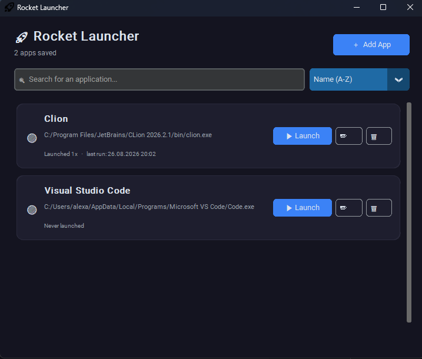
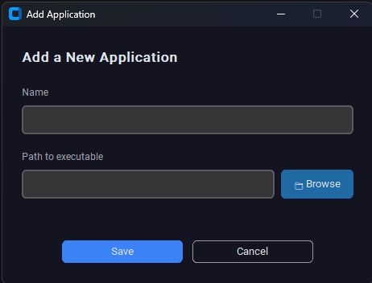

# 🚀 Rocket Launcher

A clean, modern desktop app launcher built with **CustomTkinter**.

Quickly add your favorite executables, search them, sort by usage, and launch them with one click — all from a dark, polished interface.


---

## Features

- **Add / Edit / Delete** applications with a simple dialog
- **Browse** for `.exe` files (or any executable)
- **Search** in real time
- **Sort** by:
  - Name (A–Z)
  - Most recently run
  - Most launched
- **Launch tracking** — run count + last launch timestamp
- **Visual status** — green indicator when the file exists, warning when missing
- **Keyboard shortcuts**:
  - `Ctrl + N` → Add new app
  - `Enter` / `Esc` inside dialogs
- Dark theme with modern card-based UI
- Data persisted in `data.json` (ignored by git)

---

## Screenshots




---

## Requirements

- Python 3.10+
- Windows (uses `os.startfile` and Windows-specific taskbar grouping)

```bash
pip install -r requirements.txt
```

`requirements.txt` currently contains:

```
customtkinter
```

---

## Getting Started

1. Clone the repository:

```bash
git clone https://github.com/trudix121/rocket_launcher.git
cd rocket_launcher
```

2. (Recommended) Create a virtual environment:

```bash
python -m venv venv
venv\Scripts\activate
```

3. Install dependencies:

```bash
pip install -r requirements.txt
```

4. Run the app:

```bash
python launcher.py
```

---

## Usage

1. Click **＋ Add App**
2. Enter a friendly name and select the executable path (or paste it)
3. Click **Save**
4. Use the search bar or sort menu to find apps quickly
5. Click **▶ Launch** (or double-click the card)
6. Edit or delete apps anytime with the buttons on each card

Your list is automatically saved to `data.json` in the same folder.

---

## Project Structure

```
rocket_launcher/
├── launcher.py          # Main application
├── logo.ico             # App icon
├── requirements.txt
├── .gitignore
└── data.json            # Created at runtime (your apps)
```

---

## Building a Standalone Executable (optional)

You can package it with PyInstaller:

```bash
pip install pyinstaller
pyinstaller --clean --onefile --windowed --icon=logo.ico --add-data "logo.ico;." --name RocketLauncher launcher.py
```

The finished `.exe` will appear in the `dist/` folder.

---

## License

MIT License — feel free to use, modify, and distribute.

---

Made with ☕ by [Trudix](https://github.com/trudix121)
